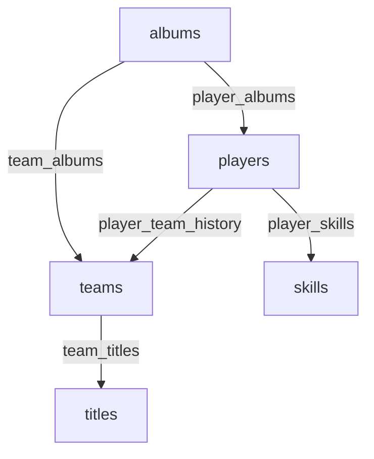

# FutBunker: Archivo Digital de Fútbol

## Descripción

FutBunker es una aplicación web diseñada como un archivo digital interactivo para entusiastas del fútbol. Permite a los usuarios explorar, gestionar y descubrir información sobre álbumes de cromos de fútbol históricos, jugadores legendarios y equipos emblemáticos. La aplicación está construida con un enfoque moderno, utilizando Next.js y React, y ofrece una interfaz intuitiva en español con modo oscuro.

## Características principales

*   **Gestión de Álbumes**: Visualiza, agrega, edita y elimina álbumes de fútbol. Incluye detalles como año, editorial, país, tipo y descripción.
*   **Integración con Google Drive**: Permite previsualizar el contenido de los álbumes directamente desde Google Drive a través de un iframe.
*   **Gestión de Jugadores**: Administra una base de datos de jugadores, incluyendo información detallada como historial de equipos, altura, peso, media de habilidad y habilidades específicas (para jugadores de campo y porteros).
*   **Gestión de Equipos**: Administra información de equipos de fútbol, incluyendo país, año de fundación, estadio, capacidad y palmarés.
*   **Vinculación de Datos**: Los jugadores y equipos pueden estar asociados a los álbumes en los que aparecen.
*   **Autenticación de Usuarios**: Sistema básico de inicio de sesión (usuario `admin`, contraseña `123` por defecto).
*   **Gestión de Usuarios (Administrador)**: Los usuarios autenticados pueden agregar nuevos usuarios al sistema (persistencia en memoria de sesión).
*   **Búsqueda y Filtrado Avanzado**: Potentes herramientas de búsqueda y filtrado en las secciones de álbumes, jugadores y equipos.
*   **Interfaz Bilingüe y Tema Oscuro**: Interfaz de usuario completamente en español y con un tema oscuro por defecto para una mejor experiencia visual.
*   **Diseño Responsivo**: Adaptable a diferentes tamaños de pantalla.

## Guía de Uso

### Acceso al Sistema

1.  Navega a la página de "Iniciar Sesión".
2.  Ingresa las credenciales:
    *   **Usuario**: `admin`
    *   **Contraseña**: `123`
3.  Haz clic en "Iniciar Sesión".
4.  Una vez autenticado, tendrás acceso a funciones de administración como agregar, editar y eliminar contenido, así como gestionar usuarios.

### Navegación Principal

La barra de navegación superior contiene los siguientes enlaces:

*   **Inicio**: Página principal con accesos directos a las secciones principales.
*   **Álbumes**: Explora la colección de álbumes de fútbol.
*   **Jugadores**: Descubre y gestiona la base de datos de jugadores.
*   **Equipos**: Explora y gestiona la información de los equipos.
*   **Menú de Usuario (Avatar)**:
    *   **Gestionar Usuarios**: (Solo visible para usuarios logueados) Permite agregar nuevos usuarios al sistema.
    *   **Cerrar Sesión**: Finaliza la sesión actual.

### Funciones Principales

*   **Visualizar Detalles**:
    *   Haz clic en una tarjeta de álbum para ver su contenido de Google Drive.
    *   Haz clic en una tarjeta de jugador o equipo para ver sus detalles completos en un modal.
*   **Agregar Contenido**: (Usuarios logueados)
    *   En las páginas de "Álbumes", "Jugadores" y "Equipos", haz clic en el botón flotante "+ Nuevo [Álbum/Jugador/Equipo]" en la esquina inferior derecha.
    *   Completa el formulario con la información requerida y guarda.
*   **Editar Contenido**: (Usuarios logueados)
    *   En cada tarjeta de álbum, jugador o equipo, haz clic en el ícono de lápiz (Editar).
    *   Modifica la información en el formulario y guarda los cambios.
*   **Eliminar Contenido**: (Usuarios logueados)
    *   En cada tarjeta de álbum, jugador o equipo, haz clic en el ícono de papelera (Borrar).
    *   Confirma la eliminación en el diálogo emergente.
*   **Agregar Usuarios**: (Usuarios logueados)
    *   Navega a "Gestionar Usuarios" desde el menú de avatar.
    *   Completa el formulario con el nuevo nombre de usuario y contraseña.
    *   *Nota: Los usuarios agregados de esta manera solo persisten en la memoria de la sesión actual del navegador.*

### Búsqueda y Filtrado

*   **Álbumes**:
    *   Utiliza la barra de búsqueda para buscar por título, editorial o año.
    *   Usa el menú "Ordenar por" para cambiar el orden de la lista.
    *   Usa el botón "Filtros" para refinar por editorial, tipo o país.
    *   Si llegas desde una tarjeta de jugador/equipo, los álbumes se filtrarán automáticamente.
*   **Jugadores**:
    *   Utiliza la barra de búsqueda para buscar por nombre.
    *   Usa los selectores para filtrar por posición, nacionalidad o equipo actual/principal.
*   **Equipos**:
    *   Utiliza la barra de búsqueda para buscar por nombre.
    *   Usa el selector para filtrar por país.

## Roles de usuario

Actualmente, el sistema maneja dos estados principales para los usuarios:

*   **Usuario No Autenticado (Invitado)**: Puede navegar por las secciones de Álbumes, Jugadores y Equipos, y ver la información pública. No puede realizar cambios (agregar, editar, borrar) ni acceder a la gestión de usuarios.
*   **Usuario Autenticado (Administrador)**: Tras iniciar sesión (ej. `admin`/`123`), tiene acceso completo a todas las funcionalidades, incluyendo:
    *   Agregar, editar y eliminar álbumes, jugadores y equipos.
    *   Agregar nuevos usuarios al sistema (estos nuevos usuarios tendrán los mismos privilegios que el administrador una vez que inicien sesión).

No existe una granularidad de permisos más allá de estos dos estados en la implementación actual.

## Despliegue

FutBunker es una aplicación Next.js y puede ser desplegada en diversas plataformas que soportan aplicaciones Node.js y sirven contenido estático/SSR, como:

*   Vercel (recomendado para Next.js)
*   Netlify
*   Firebase Hosting (con configuración para SSR mediante Cloud Functions si es necesario)
*   Servidores propios o VPS con Node.js.

Para un despliegue de producción, se necesitaría configurar un backend persistente (ej. Firebase Firestore, Firebase Auth) en lugar del sistema actual de datos mock y autenticación en memoria/JSON.

## Tecnologías

*   **Framework Frontend**: Next.js (v15+)
*   **Librería UI**: React (v18+)
*   **Lenguaje**: TypeScript
*   **Estilos**: Tailwind CSS
*   **Componentes UI**: ShadCN UI
*   **Iconos**: Lucide Icons
*   **Gestión de Formularios**: React Hook Form
*   **Gestión de Estado (Cliente)**: React Context API, `useState`, `useMemo`, `useEffect`
*   **Notificaciones (Toasts)**: Implementación personalizada (inspirada en `react-hot-toast`)
*   **Inteligencia Artificial (Stack Configurado)**: Genkit (aunque no se utiliza activamente para las funciones principales actuales, está integrado en el stack base).

## Arquitectura del Sistema

### Componentes principales:

1.  **Frontend (Next.js)**:
    *   **App Router**: Manejo de rutas y renderizado (Server Components y Client Components).
    *   **Componentes React**: UI modular y reutilizable (`src/components`).
    *   **Páginas**: Vistas principales de la aplicación (`src/app`).
    *   **Contextos**: Para gestión de estado global (ej. `AuthContext`).
2.  **Gestión de Datos (Prototipo)**:
    *   **Archivos Mock JSON/TS**: Los datos iniciales de álbumes, jugadores y equipos se cargan desde `src/data/`.
    *   **Estado Local (React)**: Las modificaciones (agregar, editar, eliminar) se reflejan en el estado local de los componentes de página y se pierden al recargar si no se persisten en un backend.
    *   **`localStorage`**: Utilizado por `AuthContext` para persistir la sesión del usuario en el navegador.
3.  **Autenticación (Prototipo)**:
    *   **`AuthContext`**: Maneja el estado de autenticación del usuario.
    *   **`users.json`**: Almacena credenciales de usuario para validación (solo para prototipo, no seguro para producción).

### Base de Datos (Supabase)

La aplicación utiliza una base de datos PostgreSQL con las siguientes tablas principales:

#### Tabla `albums`

*   `id` (text, PK)
*   `title` (text)
*   `year` (integer)
*   `publisher` (text)
*   `cover_image` (text)
*   `description` (text, nullable)
*   `country` (text, nullable)
*   `type` (text, nullable)
*   `drive_link` (text, nullable)
*   `data_ai_hint` (text, nullable)

#### Tabla `players`

*   `id` (text, PK)
*   `name` (text)
*   `current_team` (text, nullable)
*   `position` (text)
*   `date_of_birth` (text)
*   `nationality` (text)
*   `photo_url` (text)
*   `appearances` (integer, nullable)
*   `goals` (integer, nullable)
*   `height` (numeric, nullable)
*   `weight` (numeric, nullable)
*   `rating` (numeric, nullable)

#### Tabla `teams`

*   `id` (text, PK)
*   `name` (text)
*   `country` (text)
*   `foundation_year` (integer)
*   `stadium_name` (text)
*   `stadium_capacity` (integer, nullable)
*   `logo_url` (text)

#### Tablas de relación

*   `player_albums`: Relación muchos-a-muchos entre jugadores y álbumes
*   `player_skills`: Habilidades específicas de los jugadores
*   `player_team_history`: Historial de equipos de los jugadores
*   `team_albums`: Relación muchos-a-muchos entre equipos y álbumes
*   `team_titles`: Títulos ganados por los equipos

#### Gestión de usuarios

*   `user_management`: Usuarios y roles del sistema

### Diagrama de relaciones



### Flujo de datos:

*   **Carga Inicial**: Los datos se cargan desde archivos mock (`src/data/*`) al estado inicial de los componentes de página (`useState`).
*   **Renderizado**: Next.js renderiza las páginas, combinando Server y Client Components.
*   **Interacciones del Usuario**:
    *   Las acciones del usuario (clics, envíos de formulario) son manejadas por funciones en los componentes cliente.
    *   Las operaciones CRUD actualizan el estado local de React, lo que provoca un nuevo renderizado de las partes afectadas de la UI.
    *   La autenticación se valida contra `users.json` (cargado en `AuthContext`) y el estado de sesión se guarda/lee de `localStorage`.
*   **Navegación**: Gestionada por el App Router de Next.js.

## Diagrama de flujo (flujograma)

Un flujo de usuario típico podría ser:

- **Usuario visita la página de Inicio.**
-   ➡️ Ve opciones para explorar Álbumes, Jugadores o Equipos.
- **Usuario navega a "Álbumes".**
-   ➡️ Ve lista de álbumes. Puede buscar, ordenar, filtrar.
-   ➡️ Hace clic en un álbum ➡️ Se abre modal con iframe de Google Drive.
- **Usuario intenta agregar un álbum.**
-   ➡️ Si no está logueado ➡️ No ve el botón "+ Nuevo Álbum".
-   ➡️ Si está logueado ➡️ Clic en "+ Nuevo Álbum" ➡️ Abre modal con formulario ➡️ Completa y guarda ➡️ Álbum aparece en la lista (estado local).
- **Usuario decide iniciar sesión.**
-   ➡️ Va a "Iniciar Sesión" ➡️ Ingresa `admin`/`123` ➡️ Logueado exitosamente.
-   ➡️ Ahora ve opciones de edición/borrado y "Gestionar Usuarios".
- **Usuario (admin) va a "Gestionar Usuarios".**
-   ➡️ Ve lista de usuarios ➡️ Agrega un nuevo usuario ➡️ Nuevo usuario aparece en la lista (estado local).


1.  **Usuario visita la página de Inicio.**
    *   ➡️ Ve opciones para explorar Álbumes, Jugadores o Equipos.
2.  **Usuario navega a "Álbumes".**
    *   ➡️ Ve lista de álbumes. Puede buscar, ordenar, filtrar.
    *   ➡️ Hace clic en un álbum ➡️ Se abre modal con iframe de Google Drive.
3.  **Usuario intenta agregar un álbum.**
    *   ➡️ Si no está logueado ➡️ No ve el botón "+ Nuevo Álbum".
    *   ➡️ Si está logueado ➡️ Clic en "+ Nuevo Álbum" ➡️ Abre modal con formulario ➡️ Completa y guarda ➡️ Álbum aparece en la lista (estado local).
4.  **Usuario decide iniciar sesión.**
    *   ➡️ Va a "Iniciar Sesión" ➡️ Ingresa `admin`/`123` ➡️ Logueado exitosamente.
    *   ➡️ Ahora ve opciones de edición/borrado y "Gestionar Usuarios".
5.  **Usuario (admin) va a "Gestionar Usuarios".**
    *   ➡️ Ve lista de usuarios ➡️ Agrega un nuevo usuario ➡️ Nuevo usuario aparece en la lista (estado local).

## Estructura de la base de datos (DER)

Aunque no hay una base de datos relacional formal, la estructura de los datos (definida en `src/types/index.ts`) se puede conceptualizar así:

*   **Album**:
    *   `id` (PK, string)
    *   `title` (string)
    *   `year` (number)
    *   `publisher` (string)
    *   `coverImage` (string)
    *   `description` (string, opcional)
    *   `country` (string, opcional)
    *   `type` ("Selección Nacional" | "Club" | "Liga", opcional)
    *   `driveLink` (string, opcional)
    *   `dataAiHint` (string, opcional)

*   **Player**:
    *   `id` (PK, string)
    *   `name` (string)
    *   `currentTeam` (string, opcional)
    *   `position` (PlayerPosition)
    *   `dateOfBirth` (string)
    *   `nationality` (string)
    *   `photoUrl` (string)
    *   `appearances` (number, opcional)
    *   `goals` (number, opcional)
    *   `albumIds` (array de string, FK a Album.id, opcional)
    *   `dataAiHint` (string, opcional)
    *   `teamsHistory` (array de TeamHistoryEntry, opcional)
        *   `teamName` (string)
        *   `yearsPlayed` (string)
    *   `height` (number, opcional)
    *   `weight` (number, opcional)
    *   `rating` (number, opcional)
    *   `skills` (objeto con habilidades numéricas, opcional)
    *   `totalSkills` (number, opcional)

*   **Team**:
    *   `id` (PK, string)
    *   `name` (string)
    *   `country` (string)
    *   `foundationYear` (number)
    *   `stadiumName` (string)
    *   `stadiumCapacity` (number, opcional)
    *   `logoUrl` (string)
    *   `titles` (array de string, opcional)
    *   `albumIds` (array de string, FK a Album.id, opcional)
    *   `dataAiHint` (string, opcional)

*   **UserCredentials**:
    *   `username` (string)
    *   `password` (string, opcional en tipo pero presente en `users.json`)

**Relaciones (Conceptuales):**
*   Player.albumIds <-> Album.id (Muchos a Muchos, a través de array de IDs)
*   Team.albumIds <-> Album.id (Muchos a Muchos, a través de array de IDs)

## Estructura del código (UML)

(Descripción textual de la estructura de directorios principal)

*   `src/`
    *   `app/`: Contiene las rutas y páginas principales de la aplicación (App Router de Next.js).
        *   `(pagina)/page.tsx`: Archivo principal de cada ruta.
        *   `layout.tsx`: Layout raíz.
        *   `globals.css`: Estilos globales y variables CSS de Tailwind/ShadCN.
    *   `components/`: Componentes React reutilizables.
        *   `layout/`: Componentes relacionados con la estructura de la página (ej. `app-layout.tsx` para la barra de navegación).
        *   `ui/`: Componentes de UI de ShadCN (Button, Card, Dialog, etc.).
        *   `albums/`, `players/`, `teams/`: Componentes específicos de cada sección (ej. `album-card.tsx`).
    *   `contexts/`: Contextos de React para gestión de estado global (ej. `AuthContext.tsx`).
    *   `data/`: Archivos con datos mock (ej. `mock-albums.ts`, `users.json`).
    *   `hooks/`: Hooks personalizados (ej. `use-toast.ts`, `use-mobile.ts`).
    *   `lib/`: Utilidades generales (ej. `utils.ts` para `cn`, `firebaseConfig.ts` si se implementa).
    *   `types/`: Definiciones de tipos TypeScript (ej. `index.ts` con todas las interfaces).
    *   `ai/`: (Configurado por Genkit)
        *   `genkit.ts`: Configuración de Genkit.
        *   `dev.ts`: Punto de entrada para el desarrollo de flujos Genkit.
        *   `flows/`: (Potencialmente para flujos de IA).

## Diagrama de secuencia

**Ejemplo: Inicio de Sesión del Usuario**

1.  **Usuario**: Navega a `/login`.
2.  **LoginPage (Cliente)**: Renderiza el formulario de inicio de sesión.
3.  **Usuario**: Ingresa `username` y `password`, hace clic en "Iniciar Sesión".
4.  **LoginPage (Cliente)**: Llama a `handleSubmit`.
5.  **LoginPage (Cliente)**: Llama a `login(username, password)` del `AuthContext`.
6.  **AuthContext (Cliente)**:
    *   Busca el usuario en su estado `appUsers` (cargado desde `users.json`).
    *   Compara la contraseña.
    *   Si coincide:
        *   Actualiza su estado interno `user`.
        *   Guarda el usuario en `localStorage`.
        *   Retorna `true`.
    *   Si no coincide:
        *   Retorna `false`.
7.  **LoginPage (Cliente)**:
    *   Si `login` retorna `true` ➡️ Muestra toast de éxito, redirige a `/`.
    *   Si `login` retorna `false` ➡️ Muestra toast de error.
8.  **AppLayout (Cliente)**: Detecta el cambio en `AuthContext.user` y actualiza la UI (ej. muestra avatar y menú de usuario).

## Seguridad

### Autenticación y Autorización

*   **Autenticación (Prototipo)**: Se realiza en el lado del cliente comparando credenciales con `users.json`. El estado de sesión se guarda en `localStorage`. **Esto no es seguro para producción.** Las contraseñas no están hasheadas.
*   **Autorización**: No hay roles definidos más allá de "autenticado" o "no autenticado". Los usuarios autenticados tienen todos los permisos de modificación.

**Recomendaciones para Producción**: Implementar Firebase Authentication o un sistema de backend similar con hashing de contraseñas y gestión segura de sesiones (ej. JWTs, cookies HTTPOnly).

### Protección de Datos

*   Los datos de la aplicación (álbumes, jugadores, equipos) actualmente residen en archivos mock y en el estado del cliente. No se almacena información personal sensible más allá de los nombres de usuario/contraseñas de prueba en `users.json`.
*   La integración con Google Drive depende de los permisos de los archivos en Drive.

**Recomendaciones para Producción**: Usar una base de datos segura (ej. Firestore) con reglas de acceso adecuadas. Encriptar datos sensibles en reposo y en tránsito.

### Seguridad en la Red

*   Si la aplicación se despliega, debe servirse sobre HTTPS para encriptar la comunicación entre el cliente y el servidor.
*   Las interacciones con Google Drive (iframe) también se realizan sobre HTTPS.

## Desarrollo y Créditos

*   Este proyecto fue prototipado y desarrollado con la asistencia de Firebase Studio (App Prototyper AI).
*   Inspirado en la pasión por el fútbol y el coleccionismo de álbumes.

## Licencia

Este proyecto es de código abierto y se distribuye bajo la Licencia MIT. Consulta el archivo `LICENSE` para más detalles (actualmente no existe, se debería añadir uno si se desea especificar una licencia).

*(Puedes reemplazar esta sección con la licencia que elijas, por ejemplo, MIT).*

## Troubleshooting

### Port 9002 already in use
If you encounter this error when running `npm run dev`:
```
Error: listen EADDRINUSE: address already in use :::9002
```

Solutions:
1. **Kill the process using port 9002**:
   ```powershell
   netstat -ano | findstr :9002  # Find the process ID
   taskkill /PID <PID> /F        # Replace <PID> with the actual process ID
   ```
2. **Use a different port**:
   ```powershell
   npm run dev -- -p 9003
   ```

## Getting Started

### Prerequisites
- Node.js v18+
- npm or yarn

### Installation
```bash
npm install
```

### Development
```bash
npm run dev
```

### Production Build
```bash
npm run build
npm run start
```
